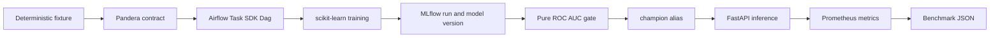

# End-to-End MLOps Pipeline

> **58.696 seconds median time to production:** three successful Airflow DagRuns, ROC AUC `0.928`, inference p95 `72.733 ms`, `160.275 req/s`, and zero failures.

**Status:** published; evidence HEAD `0249659` passed every gate in [GitHub Actions run 30780951251](https://github.com/Brilhante29/mlops-end2end/actions/runs/30780951251).

This repository proves the complete operational path around a small CPU model: orchestration, data validation, experiment tracking, registry governance, quality-gated promotion, inference, telemetry, and reproducible evidence.

## Run

```bash
docker build -t mlops-end2end .
docker run --rm mlops-end2end
```

No API key, cloud account, GPU, host Python, shell-specific script, or manual promotion is required. The same commands work on Linux, macOS, and Windows with Docker.

## Benchmark

Three clean lifecycle runs execute the versioned DAG through Airflow `dags test`, initialize the direct SQLite MLflow registry, quality-gate and promote the model, then stop the primary timer when the alias-backed FastAPI health check succeeds.

| Metric | Median | Samples |
|---|---:|---:|
| Time to production | **58.696 s** | 57.373 / 59.140 / 58.696 s |
| ROC AUC | **0.928** | identical quality across 3 runs |
| Inference p95 | **72.733 ms** | 300 requests/run after 20 warmups |
| Throughput | **160.275 req/s** | concurrency 8 |
| Image size | **1,532,464,403 bytes** | immutable source image |

The time-to-production range is `1.767 s`, or `3.0104%` of the median. All runs completed with zero failures. Source commit: `9e8c76d`; image digest: `sha256:5228391a3b888a26c0fa5263d5a2393694ee6f862a80e48d7839ad22a2fb541f`.

| Lifecycle stage | Median |
|---|---:|
| Airflow metadata migration | 9.684 s |
| Airflow DagRun, training, registry, and promotion | 38.355 s |
| Alias-backed API startup | 10.581 s |

The command prints the complete JSON result. A bind mount can persist it:

```bash
docker run --rm \
  -v "$(pwd)/benchmarks/results:/results" \
  -e BENCHMARK_OUTPUT=/results/local.json \
  mlops-end2end
```

PowerShell uses the same image with `${PWD}` in the volume value.

Publication evidence runs three clean lifecycle containers and writes raw V1 plus provenance-rich V2 JSON. In V2, `measured_iterations=3` counts lifecycle samples; `warmup_iterations=20` and inference concurrency 8 apply only to the secondary HTTP measurement:

```bash
python tools/publish_benchmark.py
```

## System



Pipeline architecture is the primary style because the problem is an ordered, retryable artifact lifecycle. A ports-and-adapters boundary is used only where it earns its cost: the domain quality policy depends on a small registry port, not MLflow. Airflow, MLflow, FastAPI, storage, and Prometheus remain outside that policy. The lifecycle now executes the versioned DAG through `airflow dags test`, so task dependencies and retries are part of the proof.

## Decisions

- **Airflow:** dependencies, retries, and stage evidence are part of the claim; the Dag uses the stable Airflow 3 `airflow.sdk` surface and the official slim image pinned by OCI digest.
- **MLflow:** the local path uses the registry directly through SQLite, avoiding a redundant HTTP server; FastAPI still resolves the mutable `champion` alias instead of a hard-coded version.
- **REST:** prediction is one fixed command-shaped operation. GraphQL adds no selection or aggregation value here.
- **No broker:** there is no event stream, fan-out, or asynchronous throughput requirement, so Kafka and RabbitMQ would be decorative.
- **No cloud:** the measured path exercises no AWS behavior. Kumo becomes the first local option only when a concrete AWS service enters scope.
- **No drift:** this service exports the evidence that #22 will consume; drift detection keeps its own repository and benchmark.

The complete tradeoffs and self-questions live in [OpenSpec](openspec/changes/ship-mlops-end2end/design.md) and [SDD](sdd/architecture-decision.md).

## Verification

```bash
docker run --rm --entrypoint ruff mlops-end2end check src tests dags
docker run --rm --entrypoint pytest mlops-end2end -q
docker run --rm --entrypoint pytest mlops-end2end tests/test_quality.py tests/test_data.py tests/test_runner.py --cov=mlops_end2end.domain --cov=mlops_end2end.application --cov=mlops_end2end.adapters.data --cov-report=term-missing --cov-fail-under=80
```

Unit tests substitute the MLflow adapter with a recording registry, proving DIP and LSP at the promotion boundary. The default Docker run is the integration, contract, and benchmark proof.

## Scope

The generated classification data is synthetic, deterministic, CPU-only, and not a medical, financial, or production risk model. SQLite and single-process services are deliberate local benchmark choices, not a high-availability deployment recommendation.

## Reuse

The repository consumes the decision brain, component pack, OpenSpec schema, architecture selector, language profiles, skills, SDD templates, design tokens, validator, and benchmark contract from `portfolio-reuse-kit`. Project-specific training and serving code remains here.

See [REFERENCES.md](REFERENCES.md) for primary documentation and attributed organizational references.
