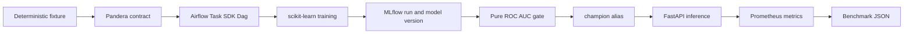

# #21 mlops-end2end

> **118.832 seconds median time to production:** three successful local lifecycle runs, ROC AUC `0.928441`, inference p95 `100.275 ms`, and no paid service or credential.

This repository proves the complete operational path around a small CPU model: orchestration, data validation, experiment tracking, registry governance, quality-gated promotion, inference, telemetry, and reproducible evidence.

## Run

```bash
docker build -t mlops-end2end .
docker run --rm mlops-end2end
```

No API key, cloud account, GPU, host Python, shell-specific script, or manual promotion is required. The same commands work on Linux, macOS, and Windows with Docker.

## Benchmark

The primary metric starts inside the container before local metadata stores are initialized. It stops only when the Airflow Dag has completed and FastAPI is healthy with `models:/portfolio-risk-model@champion` loaded.

| Metric | Baseline | What it proves |
|---|---:|---|
| Time to production | **118.832 s median** (96.530-123.678) | Full lifecycle friction from empty runtime to healthy promoted model |
| ROC AUC | **0.928441** in all runs | Candidate quality before promotion |
| Inference p95 | **100.275 ms median** | Serving latency after promotion |
| Throughput | **115.415 req/s median** | CPU request capacity for the fixed fixture |
| Image size | **1.53 GB** (`-39.145%`) | Slim official Airflow base versus the regular reference image |

Three runs used the same image content and deterministic fixture. Model quality was identical; lifecycle time had a 22.845% max-min range relative to the median, so the repository reports both the median and raw results.

| Lifecycle stage | Median |
|---|---:|
| MLflow startup | 22.870 s |
| Airflow metadata migration | 14.621 s |
| Airflow Dag, training, registry, and promotion | 62.431 s |
| Alias-backed API startup | 18.856 s |

The command prints the complete JSON result. A bind mount can persist it:

```bash
docker run --rm \
  -v "$(pwd)/benchmarks/results:/results" \
  -e BENCHMARK_OUTPUT=/results/local.json \
  mlops-end2end
```

PowerShell uses the same image with `${PWD}` in the volume value.

## System



Pipeline architecture is the primary style because the problem is an ordered, retryable artifact lifecycle. A ports-and-adapters boundary is used only where it earns its cost: the domain quality policy depends on a small registry port, not MLflow. Airflow, MLflow, FastAPI, storage, and Prometheus remain outside that policy.

## Decisions

- **Airflow:** dependencies, retries, and stage evidence are part of the claim; the Dag uses the stable Airflow 3 `airflow.sdk` surface and the official slim image pinned by OCI digest.
- **MLflow:** a database-backed local registry records runs and versions; FastAPI resolves the mutable `champion` alias instead of a hard-coded version.
- **REST:** prediction is one fixed command-shaped operation. GraphQL adds no selection or aggregation value here.
- **No broker:** there is no event stream, fan-out, or asynchronous throughput requirement, so Kafka and RabbitMQ would be decorative.
- **No cloud:** the measured path exercises no AWS behavior. Kumo becomes the first local option only when a concrete AWS service enters scope.
- **No drift:** this service exports the evidence that #22 will consume; drift detection keeps its own repository and benchmark.

The complete tradeoffs and self-questions live in [OpenSpec](openspec/changes/ship-mlops-end2end/design.md) and [SDD](sdd/architecture-decision.md).

## Verification

```bash
docker run --rm --entrypoint ruff mlops-end2end check src tests dags
docker run --rm --entrypoint pytest mlops-end2end -q
docker run --rm --entrypoint pytest mlops-end2end tests/test_quality.py tests/test_data.py tests/test_runner.py --cov=mlops_end2end.domain --cov=mlops_end2end.application --cov=mlops_end2end.adapters.data --cov-report=term-missing --cov-fail-under=80
```

Unit tests substitute the MLflow adapter with a recording registry, proving DIP and LSP at the promotion boundary. The default Docker run is the integration, contract, and benchmark proof.

## Scope

The generated classification data is synthetic, deterministic, CPU-only, and not a medical, financial, or production risk model. SQLite and single-process services are deliberate local benchmark choices, not a high-availability deployment recommendation.

## Reuse

The repository consumes the decision brain, component pack, OpenSpec schema, architecture selector, language profiles, skills, SDD templates, design tokens, validator, and benchmark contract from `portfolio-reuse-kit`. Project-specific training and serving code remains here.

See [REFERENCES.md](REFERENCES.md) for primary documentation and attributed organizational references.
